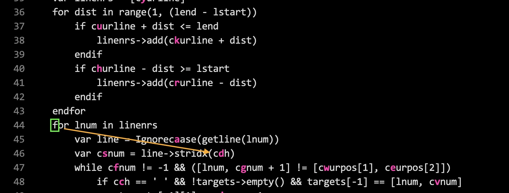
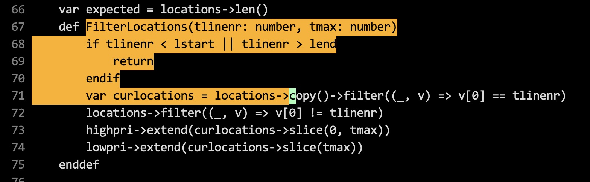

# EasyJump.vim

Jump to any location by typing 2 characters.

- Mapped to `s` but any other trigger (like `,`) can be configured (see below).
- Vim idioms supported. Use `dsxy` to delete, `csxy` to change, `vsxy` to select visually, etc.
- Jump list (`:jumps`) updated so that you can jump back using `<c-o>`.
- Does not alter the buffer. Written in vim9 script.

🚀 **Jump (ex. `scd`)**: Type `s` and `c` (say) and you'll see new tags
appear replacing to all the occurrences of `c`. Type `d` (for
instance) and cursor jumps to the `c` under `d`.



🚀 **Jump back**: Type `<c-o>` (control-O). Jump forward with `<tab>` or `<c-i>'.

🚀 **Visual Select (ex. `vscd`)**: To visually select a block of text starting
from cursor position to some occurrence of `c` type `vsc` and then type the
highlighted character (say `d`).



Similarly, `dsxy` to delete, `csxy` to change text.

Type `<esc>` to **cancel** the jump.

Above illustrations use `:colorscheme quiet`.

**What if there is no letter next to where you want to jump to?**

This happens when there are not enough available unique letters. Simply type
`<Tab>` (or `,`, or `;`) and you'll see letters appear in remaining
locations.

**Motivation:** For a long time I have used relative numbers with `j`/`k` along
with `f`/`t` commands to jump. But I always found it distracting to shift focus to the left to
look up the line number. This plugin helps you keep your eyes on the
target. I think this is the missing motion of Vim.

# Requirements

- Vim >= 9.0

# Installation

Install using [vim-plug](https://github.com/junegunn/vim-plug). Put the following in `.vimrc` file.

```
vim9script
plug#begin()
Plug 'girishji/easyjump.vim'
plug#end()
```

Legacy script:

```
call plug#begin()
Plug 'girishji/easyjump.vim'
call plug#end()
```

Or use Vim's builtin package manager.

# Configuration

### Trigger Key

By default `s` is the trigger key. To restore it to default (`:h s`) put the following in `.vimrc`
file.

```
g:easyjump_default_keymap = false
```

To make `,` trigger the jump put the following in `.vimrc` file. Any other key
can also be used beside `,`.

```
nmap , <Plug>EasyjumpJump;
omap , <Plug>EasyjumpJump;
vmap , <Plug>EasyjumpJump;
```

### Case

To make the search case sensitive (case), insensitive (icase), or smart case
(smart) put the following in `.vimrc`.

```
g:easyjump_case = 'smart' # Can be 'case', 'icase', or 'smart' (default).
```

### Highlight

The virtual text that appears next to destination locations uses highlighted
group `EasyJump`. It is linked to `IncSearch` by default. Set this group using
`:highlight` command to change colors.

### Letters

Jump locations are prioritized based on the distance from the cursor. Tag letters
are placed in the following order, with at least one letter per line. The
order of letters can be changed through the following global variable.

```
g:easyjump_letters = 'asdfgwercvhjkluiopynmbtqxzASDFGWERCVHJKLUIOPYNMBTQXZ0123456789'
```
